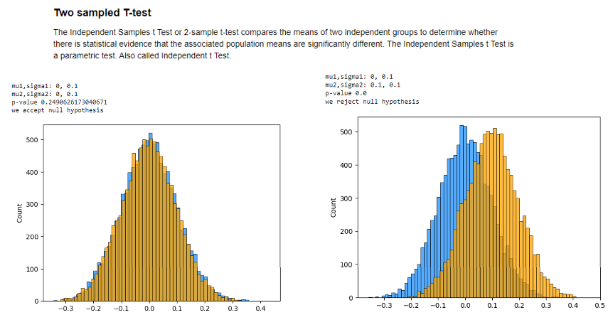
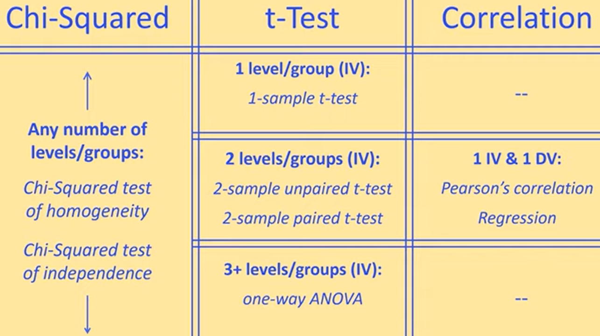

# Hypothesis-Testing-with-Python
Hypothesis testing and various statistical concepts with Python

 

 

For table, see: https://www.youtube.com/watch?v=ulk_JWckJ78

### References

[1] D’Agostino, R. B. (1971), “An omnibus test of normality for moderate and large sample size”, Biometrika, 58, 341-348

[2] D’Agostino, R. and Pearson, E. S. (1973), “Tests for departure from normality”, Biometrika, 60, 613-622